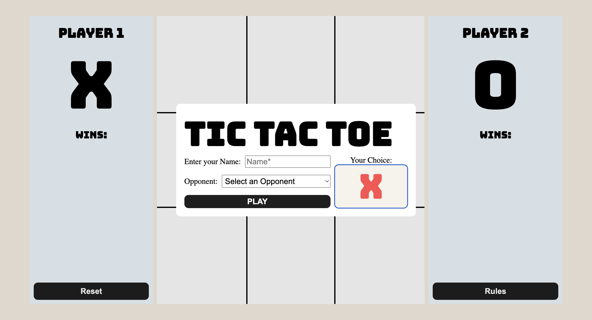
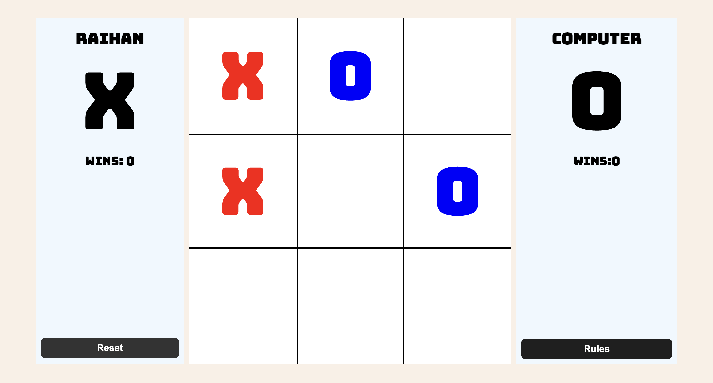

# Tic Tac Toe
Tic Tac Toe Game made with Js, HTML/CSS.

This project I focused on making my Javascript modular and It has taught me how beneficial modular programming is for large scale apps and how to turn my spaghetti code into a more readable and reusable product.

## Features

- Select your opponent which includes Couch Co-op and against the Computer
- Updating Wins Counter!
- Choose to Start with X's or O's
- Reset btn that lets you change your opponent or starting symbol!
- Rules btn that'll direct you to Wikipedia for a quick refresher!
- Clean and Modern UI

[Live Demo](https://raihancarder.github.io/tic-tac-toe/)

## Screenshots

## Installation

1. Clone the repo  
   `git clone https://github.com/raihanCarder/tic-tac-toe.git`

2. Navigate to the folder  
   `cd tic-tac-toe`

3. Open `index.html` in your browser (or run with Live Server)

## Tech Stack
- Javascript
- HTML
- CSS

Created by Raihan Carder(https://github.com/raihanCarder)  
Feel free to reach out!

